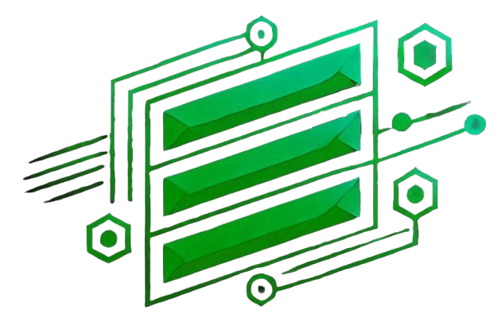

# EficienSys

Sistema de comunicação empresarial que conecta gerentes e colaboradores em uma plataforma simples e intuitiva.



---

## Sobre o Projeto

O **EficienSys** é uma solução para comunicação interna de equipes, permitindo que gerentes e colaboradores troquem mensagens em um mural compartilhado. O sistema possui uma landing page institucional e uma área restrita com autenticação.

### Funcionalidades

- **Landing Page** - Apresentação do produto com benefícios, planos e informações
- **Sistema de Login** - Autenticação de usuários com validação de credenciais
- **Mural de Mensagens** - Comunicação da equipe em tempo real
- **Perfis de Usuário** - Diferenciação entre gerentes e colaboradores
- **Design Responsivo** - Funciona em desktop, tablet e mobile

---

## Tecnologias Utilizadas

| Tecnologia | Uso |
|------------|-----|
| HTML5 | Estrutura das páginas |
| CSS3 | Estilização e responsividade |
| JavaScript | Lógica e interatividade |
| LocalStorage | Armazenamento de dados no navegador |
| Squeleton CSS | Framework de utilitários e grid |

---

## Estrutura do Projeto

```
EficienSys/
├── index.html          # Landing page principal
├── README.md           # Documentação do projeto
├── app/
│   ├── login.html      # Página de login
│   └── sistema.html    # Dashboard do sistema
└── imagens/
    └── logoEficieSys.png
```

---

## Como Usar

### Acesso Online (GitHub Pages)

1. Acesse a landing page:
   ```
   https://seuusuario.github.io/EficienSys/
   ```

2. Acesse o sistema:
   ```
   https://seuusuario.github.io/EficienSys/app/login.html
   ```

### Acesso Local

1. Clone o repositório:
   ```bash
   git clone https://github.com/seuusuario/EficienSys.git
   ```

2. Abra o arquivo `index.html` no navegador para ver a landing page

3. Abra `app/login.html` para acessar o sistema

---

## Credenciais de Teste

| Email | Senha | Cargo |
|-------|-------|-------|
| admin@eficiensys.com | 123456 | Gerente |
| joao@eficiensys.com | 123456 | Colaborador |
| maria@eficiensys.com | 123456 | Colaborador |

---

## Screenshots

### Landing Page
- Hero section com chamada principal
- Seção de benefícios
- Planos e preços
- Depoimentos de clientes

### Sistema
- Tela de login com validação
- Dashboard com boas-vindas personalizada
- Mural de mensagens da equipe
- Header com informações do usuário logado

---

## Funcionalidades do Sistema

### Login
- Validação de email e senha
- Redirecionamento automático se já estiver logado
- Mensagens de erro para credenciais inválidas

### Dashboard
- Saudação personalizada com nome do usuário
- Badge indicando o cargo (Gerente/Colaborador)
- Formulário para enviar mensagens
- Lista de mensagens ordenadas por data

### Mural de Mensagens
- Exibição do nome e cargo do autor
- Data e hora da mensagem
- Limite de 50 mensagens (as mais antigas são removidas)
- Atualização automática a cada 10 segundos

---

## Configuração do GitHub Pages

1. Vá até o repositório no GitHub

2. Clique em **Settings** (Configurações)

3. No menu lateral, clique em **Pages**

4. Em **Source**, selecione:
   - Branch: `main` (ou `master`)
   - Folder: `/ (root)`

5. Clique em **Save**

6. Aguarde alguns minutos e acesse a URL fornecida

---

## Limitações

Por ser uma aplicação frontend-only hospedada no GitHub Pages:

- **Dados locais**: As mensagens ficam salvas no localStorage do navegador de cada usuário
- **Sem sincronização**: Usuários diferentes não compartilham mensagens entre si
- **Sem persistência no servidor**: Os dados são perdidos se o usuário limpar o navegador

> Para uma versão com dados compartilhados, seria necessário um backend com banco de dados.

---

## Personalização

### Alterar Usuários

Edite o array `usuarios` no arquivo `app/login.html`:

```javascript
const usuarios = [
    { email: 'seu@email.com', senha: 'suasenha', nome: 'Seu Nome', cargo: 'gerente' },
    // Adicione mais usuários...
];
```

### Alterar Cores

As cores principais do sistema são:

```css
--verde-escuro: #166534;
--verde-claro: #22c55e;
--verde-hover: #16a34a;
```

---

## Autor

Desenvolvido como projeto de demonstração de sistema de comunicação empresarial.

---

## Licença

Este projeto está sob a licença MIT. Sinta-se livre para usar, modificar e distribuir.
